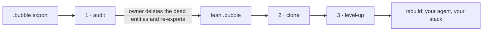

<p align="center">
  
</p>

<h1 align="center">UnBubble</h1>

<p align="center">
  <strong>Take an app off Bubble.io — audited, documented and re-architected — with the coding agent you already use.</strong>
</p>

<p align="center">
  <a href="LICENSE"></a>
  
  
  
  <a href="https://github.com/pedrobefree/befree-bubble-mcp"></a>
</p>

---

UnBubble is an open-source toolkit for owners, agencies and developers who are moving an app off
**Bubble.io** to a codebase they own, without losing features, data or credentials on the way. You
hand your coding agent the app's `.bubble` export; UnBubble's skills give it the method, and its
scripts give it facts instead of guesses:

1. **Audit** — what in the app is dead, so the owner can clean it up and re-export it lean.
2. **Clone** — what remains, written up as verifiable as-is documentation and a feature-parity PRD,
   with every credential preserved.
3. **Level-up** — the target architecture, the new data model, the data-migration plan and an
   AI-ready backlog for the rebuild.

Everything runs on your machine. An optional **connected mode** reaches into the live app — logs,
workload, fresh exports, what each user role sees, the cleanup applied on a branch — and is built on
[**befree-bubble-mcp**](https://github.com/pedrobefree/befree-bubble-mcp) by Pedro Duarte (Befree
Academy), vendored here in a hardened edition. See [Credits](#credits).

## Why

- **A Bubble app leaves with one file.** The `.bubble` export is a single JSON document: every page,
  element, workflow, data type, option set, plugin and API call, wired together by generated ids.
  It is the only complete description of the app, and it is too big and too indirect to read by
  hand.
- **Years of editing leave dead weight.** Pages nothing navigates to, workflows nothing triggers,
  plugins nobody uses (some still on a paid plan), fields nothing reads. Rebuilding them is waste;
  rebuilding without knowing which ones they are is guesswork.
- **An agent reading a raw export guesses.** UnBubble's scripts resolve the references
  deterministically — what points to what, what is dead, which keys exist, which migrated columns
  the new code really uses — and the skills turn those facts into documents a person can check.
- **A rebuild is more than code.** Credentials, Data API consumers, the data migration and the
  cutover are where migrations break; the pipeline plans each of them explicitly.

## How it works



| Step | Skill | Input | Output |
|---|---|---|---|
| 1 | `audit` | `.bubble` export | Interactive HTML report of unused and dead entities in 10 areas — pages, reusables, backend workflows, option sets, plugins, styles and design tokens, tables and fields, custom events, API Connector calls, references to removed plugins, mobile views — with confidence levels, a deletion tracker and a per-section sign-off (items kept on purpose are recorded and questioned in step 2). The owner cleans the app and **re-exports a lean `.bubble`** |
| 2 | `clone` | lean `.bubble` | As-is docs (database, external APIs, plugins, Data API exposure, backend workflows, pages and business rules written in verifiable form) + **PRD-clone** (feature-parity spec) + **PARITY-MATRIX** (one disposition per entity) + **`secrets/.env` + `ENV-KEYS.md`** (every credential the export carries, preserved for the rebuild — values never enter docs or chat) |
| 3 | `level-up` | clone docs + PRD | Tech-debt assessment, target architecture (information security and result reliability first, UX second), frontend design brief, new data model with a field-by-field old → new mapping, **data-migration plan** (CSV vs Data API, cutover, validation), PRD v2, a sequenced atomic backlog, risks and an execution contract |

Two gates keep the rebuild honest: `spec_coverage.py` (every requirement has a story) and
`parity_check.py` (every migrated column is actually used by the new code).

Every step is a **skill** — a `SKILL.md` with the method plus dependency-free Python scripts that do
the deterministic work on the export — and each skill is standalone. A **local web console** tracks
every project through the three steps. With the optional connected mode the same chain reaches into
the live app: fresh exports with provenance, runtime evidence for the audit's candidates, the
cleanup applied on a branch, what each user role sees per screen, and the Bubble side of the
cutover.

## Works with the agent you already use

The skills follow the **Agent Skills** convention — a folder with a `SKILL.md` — so any coding agent
that reads that format can run the pipeline. The Python scripts also run on their own, with no
agent at all.

| Host | How the skills are installed | How they show up |
|---|---|---|
| **Claude Code** (Anthropic) | symlink the repo into `~/.claude/skills/unbubble` (auto-loads as the `unbubble` plugin), or `claude --plugin-dir <repo>` | `unbubble:audit`, `unbubble:clone`, `unbubble:level-up` (+ the optional `unbubble:connect`) |
| **Codex** (OpenAI / ChatGPT) | link each skill into `~/.codex/skills/` (`unbubble-audit`, `unbubble-clone`, `unbubble-level-up`; optionally `unbubble-connect`) | `audit`, `clone`, `level-up` (+ `connect`) |
| **Cursor, Gemini CLI / Antigravity, GitHub Copilot CLI, OpenCode, Windsurf** and any other Agent Skills host | link each skill into the host's skills folder or into the shared `~/.agents/skills/` | `audit`, `clone`, `level-up` (+ `connect`) |
| **No agent** | run the scripts from a terminal (see below) | HTML report, JSON inventories, `.env`, coverage reports |

The console's **Install & onboarding** page detects where the skills are installed on the machine,
checks whether each copy is in sync with the repo, and prints the exact install commands per host.

## Install

Clone the repository and link the skills into the agent(s) you use. Symlinks are recommended: a
`git pull` updates every agent at once.

```bash
git clone https://github.com/yowpi-tech/unbubble.git ~/UnBubble
```

**Claude Code**

```bash
mkdir -p ~/.claude/skills && ln -sfn ~/UnBubble ~/.claude/skills/unbubble
# or, without installing: claude --plugin-dir ~/UnBubble
```

**Codex (ChatGPT)**

```bash
mkdir -p ~/.codex/skills && for s in audit clone level-up; do ln -sfn ~/UnBubble/skills/$s ~/.codex/skills/unbubble-$s; done
ln -sfn ~/UnBubble/skills/connect ~/.codex/skills/unbubble-connect   # optional: connected mode
```

**Other Agent Skills hosts** — the same three links into the host's skills folder (for example
`~/.cursor/skills`, `~/.copilot/skills`, `~/.gemini/skills`) or into the shared `~/.agents/skills`,
plus `connect` if you want the connected mode. Check the host's documentation for the exact folder.

The connected mode also needs its MCP server installed once — see
[Connected mode › Install and sign in](#install-and-sign-in).

## Quick start

1. In the Bubble editor: **Settings → General → Export application**. Keep the `.bubble` file
   wherever you like (Downloads is fine); the skills read it in place and never copy it.
2. Ask your agent to audit it, for example:
   > Audit this Bubble export and tell me what I can delete: ~/Downloads/my-app.bubble
3. Open the report, delete the dead entities in the Bubble editor, tick them off as you go, sign
   each section off, and re-export a lean `.bubble` — or, with the connected mode, let the agent
   apply the deletions on a branch, batch by batch, for your approval.
4. Ask for the clone (as-is docs + PRD-clone) on the lean export, then for the level-up.
5. Follow everything in the console:

```bash
cd ~/UnBubble/ui && npm install && npm run dev     # http://localhost:3333
```

## Project folder

All artifacts of a given app live in **one folder**, created by whichever skill touches the app
first:

```
~/UnBubble-Projects/<app-id>/
  audit/       one report per round + bubble_cleanup_progress__<app>.json (deletions,
               section sign-offs, items kept on purpose); with the connected mode also
               cleanup-applied__<app>.json (deletions applied through it) and
               runtime-evidence__<app>-vN.json (log counts per candidate)
  inventory/   JSON inventories extracted from the export                 (clone)
  secrets/     .env (live keys, chmod 600, gitignored) · .env.example · ENV-KEYS.md
  docs/        00-overview … 08-open-questions                            (clone)
  PRD-clone.md · PARITY-MATRIX.md                                          (clone)
  levelup/     ASSESSMENT · TARGET-ARCHITECTURE · FRONTEND-DESIGN · DATA-MODEL ·
               MIGRATION-PLAN · PRD-v2 · BACKLOG · RISKS · EXECUTION-CONTRACT ·
               spec-coverage · parity-report · screen-parity             (level-up)
  visual/      screens per role, Bubble and rebuilt app             (connected mode)
  unbubble.json  the console's own state (manual overrides, stories done, notes)
```

Project inputs (exports, spreadsheets) never go into this repository, and `secrets/.env` never
leaves the machine.

## Running the scripts without an agent

The core scripts are Python 3.8+ with the standard library only, and they never modify the export.
The connected-mode scripts (`skills/connect/scripts/`) are stdlib too, but drive the MCP server
installed by `mcp/install.py`.

```bash
# 1 · audit → interactive HTML report + JSON summary
python3 skills/audit/scripts/bubble_audit.py app.bubble --lang en --out report.html --json results.json

# 2 · clone → inventories and preserved credentials
python3 skills/clone/scripts/bubble_inventory.py app.bubble --outdir inventory
python3 skills/clone/scripts/bubble_secrets.py   app.bubble --outdir secrets

# 3 · level-up gates
python3 skills/level-up/scripts/spec_coverage.py --spec docs/07-business-rules.md --spec levelup/PRD-v2.md \
        --backlog levelup/BACKLOG.md --out levelup --strict-acceptance
python3 skills/level-up/scripts/parity_check.py --schema <app>/supabase/migrations --app <app>/src --out levelup
```

The interpretive parts of the pipeline — reading business rules out of workflows, writing the docs
and the PRDs, designing the target architecture — are what the skills guide an agent through; the
scripts give it deterministic facts to work from.

## Connected mode (optional)

The three core steps work offline on a `.bubble` file and never need this. The fourth skill,
**`connect`**, adds what only the live Bubble editor can answer, and it runs on
[**befree-bubble-mcp**](https://github.com/pedrobefree/befree-bubble-mcp), the open-source (MIT)
Bubble MCP server and CLI by Pedro Duarte (Befree Academy). Signing in to the editor, downloading
exports, reading logs, metrics and the changelog, capturing what a page shows and applying edits
are befree-bubble-mcp's work. UnBubble vendors it in `mcp/` as a hardened *UnBubble edition* and adds
the safety model below, the installer and launcher, and the `connect` skill with its scripts.

- **Read-only diagnostics** — server logs, workload units (WU) and what spends them, workflow run
  counts, plan usage, file storage, and the editor changelog ("who changed what, when").
- **Fresh exports** of `version-test` or a branch, each kept as an immutable copy with its
  provenance (version, time, sha256), which the audit report shows in its header.
- **Runtime evidence** for the audit's candidates — is this endpoint, webhook, page or API call
  still used? — as `logs: N×` badges in the report (`bubble_audit.py --evidence`).
- **The audit cleanup applied for you** on a dedicated branch, batch by batch: every batch is
  previewed and approved by the owner, applied, recorded in a journal and verified with a fresh
  export and a new audit round. The owner merges the branch and deploys, by hand.
- **Screens per user role** — public and logged-in pages, captured with test users — as the content
  inventory of every screen, and a **minimum screen-parity gate** for the rebuilt app (content and
  actions only: the new design system rules the visuals).
- **The Bubble side of the cutover** — Data API exposure, 301 redirects, traffic-drain checks.

> **Experimental.** befree-bubble-mcp is in early alpha and drives Bubble's undocumented editor
> endpoints, which can change without notice. Use connected mode only with the app owner's consent,
> and never unattended.

### Requirements

- Python ≥ 3.11 for the MCP (the installer uses `uv` when available, or a system Python ≥ 3.11) and
  about 500 MB of disk (venv + Chromium).
- A Bubble account that is a **collaborator on the app** — preferably a dedicated one per client.
- A paid Bubble plan to download exports, and a plan with branches for the cleanup on a branch.

### Install and sign in

```bash
python3 ~/UnBubble/mcp/install.py --register claude   # or codex | cursor | all | none (it asks by default)
python3 ~/UnBubble/mcp/launch.py doctor
```

The installer creates `~/.unbubble/mcp/venv`, installs the hash-pinned dependencies (wheels only —
the vendored package itself is not installed; the launcher puts its source on the path), downloads
Chromium, creates owner-only folders and registers the MCP server `befree-bubble-mcp` in the hosts
you choose, backing up each config file first. On hosts that link one folder per skill, link the
skill too (see [Install](#install)).

Then, once per app, **in your own terminal** — a browser window opens on the Bubble editor; sign in
with email and password (Google sign-in refuses automated browsers):

```bash
python3 ~/UnBubble/mcp/launch.py cli profile add <app-id> --app-id <app-id> --app-version test
python3 ~/UnBubble/mcp/launch.py cli session login --profile <app-id> --app-id <app-id>
```

One sign-in serves every app — Bubble signs in an account, not an app — so after the first one,
`session login` for another app opens already signed in and finishes on its own. Already signed in
through an earlier befree-bubble-mcp install? Reuse that browser instead of signing in again with
`python3 ~/UnBubble/mcp/launch.py import-browser-profile` (run it yourself; it lists the
candidates). A test version protected by a password is unlocked for screen captures with
`python3 ~/UnBubble/mcp/launch.py cli eval save-http-auth --app-id <app-id>` — the password is typed
in your terminal, never in the chat.

### Safety model

The MCP drives Bubble's editor with the session of a Bubble account, so the UnBubble edition is
built to fail closed:

- **Never live.** A write guard on every HTTP request refuses writes to the live version, the
  deploy endpoints, payloads bound to another app, and deleting a branch the MCP did not create.
  The deploy tools are removed.
- **A policy at the MCP boundary** hides and refuses raw editor writes, `batch`/`natural`, plugin
  installs, extension packs, cross-app transfers, session import, the HTML/Figma builders, the Data
  API token tools and permanent data-type deletion. A write needs `execute: true` and an explicit
  non-live `app_version`; a deletion also `confirm: true`.
- **The launcher** runs only allowlisted CLI commands, in an empty working folder, with umask 077
  and the MCP's remote features off. On top of that, the skill's write protocol adds a dedicated
  branch, a preview and the owner's approval per batch, and verification by a fresh export.
- **Secrets stay out of transcripts.** `settings.secure`, cookies and token formats are redacted
  from tool results and CLI output; sessions live under `~/.unbubble/mcp/config` (owner-only);
  logins and passwords are typed by a human, in a visible browser or a terminal prompt; logs are
  reported as counts, never rows.

Details in [`skills/connect/SKILL.md`](skills/connect/SKILL.md) and [`mcp/README.md`](mcp/README.md).

### What it does not do

Delete reusable-element definitions, backend workflows, plugins or API Connector calls (they stay
on a manual list for the owner); read database records (the migration ETL belongs to the new
system); create savepoints on `test` (only branches isolate writes); export the design to Figma or
code; deploy.

## Local console (`ui/`)

A small Next.js app that reads `~/UnBubble-Projects/` and shows, per project, how far each of the
three steps is: audit rounds and remaining findings (with the report embedded and its deletion
tracker saving straight to the project folder), the clone documentation checklist (docs, PRD,
parity matrix, open questions, preserved credentials), the level-up pack with the coverage and
parity gates, and the backlog stories ticked off as the rebuild lands. It also detects where the
skills are installed and walks a newcomer through a 4-step onboarding. With the connected mode it
shows the MCP installation, the Bubble profiles and whether each has a session (existence and date
only), a "connected" badge per project with its latest downloaded export, and the deletions applied
through it in the audit tracker. English, Portuguese and Spanish, light and dark.

There is no database: everything is derived from the files the skills write, and the console's
only own state is `<project>/unbubble.json`. Details in [`ui/README.md`](ui/README.md).

## Languages

The console ships in **English**, **Português (Brasil)** and **Español**; the language menu in the
header lists whatever is registered, and a first visit follows the browser's `Accept-Language`. The
audit report has its own language switch (`bubble_audit.py --lang pt|en`), and the skills
themselves are written in English but work in whatever language the user speaks.

### How an LLM (or a human) adds a language

These instructions are written so a coding agent can execute them verbatim. Replace `xx` with the
language code (`es`, `fr`, `de`, `it`…).

1. **Create the dictionary.** Copy `ui/src/lib/i18n/locales/en.ts` to
   `ui/src/lib/i18n/locales/xx.ts`. Rename the export to `xx`, type it as `Dictionary`
   (`export const xx: Dictionary = { … }`) and translate **only the values**. Rules:
   - keep every key exactly as it is, in the same order — the type checker fails on a missing or
     unknown key;
   - keep `{placeholders}` such as `{export}`, `{id}`, `{round}` untouched — they are filled at
     runtime;
   - keep product terms untranslated: *audit*, *clone*, *level-up*, *backlog*, *PRD*,
     *PARITY-MATRIX*, *Data API*, *option set*, *backend workflow*, *plugin*, file and folder names,
     command lines and paths;
   - keep the tone of the English source: short, direct, sentence case; UI labels use the
     infinitive or a noun, not an imperative aimed at the reader;
   - `'project.prompt.rebuild_done'` stays an empty string.
2. **Register it.** In `ui/src/lib/i18n/index.ts`, import the dictionary and append one entry to
   `LOCALES`:
   ```ts
   { code: 'xx', label: '<name of the language, in that language>', tag: '<BCP-47 tag>', matches: ['xx'], dictionary: xx },
   ```
   `tag` feeds `<html lang>` and date formatting (`es`, `fr-FR`, `pt-BR`…); `matches` lists the
   `Accept-Language` primary subtags that should select the locale automatically.
3. **Check.** Run `cd ui && npx tsc --noEmit && npx eslint src`. Then start the console, open the
   language menu, pick the new language and skim the dashboard, a project page, the audit page and
   *Install & onboarding* for strings that overflow or read wrong.
4. **Optional — the audit report.** The HTML report is generated by
   `skills/audit/scripts/bubble_audit.py` and carries its own strings in the `STR` dictionary
   (`'pt'` and `'en'` blocks). To add a report language, add a `'xx'` block with the same keys as
   `'en'` and add `'xx'` to the `--lang` choices in `main()`. Regenerate a report with
   `--lang xx` and open it to check.
5. Mention the new language in this chapter and in `ui/README.md`.

Do not translate the skills (`skills/*/SKILL.md`) or the scripts' output files: agents read them as
instructions, and the pipeline's artifacts are written in the language the user is working in.

## What is in the repository

```
skills/
  audit/        SKILL.md · scripts/bubble_audit.py · references/ (export reference model,
                marketplace plugin names and pricing)
  clone/        SKILL.md · scripts/bubble_inventory.py · scripts/bubble_secrets.py
  level-up/     SKILL.md · scripts/spec_coverage.py · scripts/parity_check.py ·
                references/assessment-checklist.md
  connect/      optional connected mode · SKILL.md · references/ (setup, diagnostics, cleanup,
                evidence, screens, cutover) · scripts/ (export download, runtime evidence, cleanup
                plan + journal, screen captures, screen parity)
ui/             the local console (Next.js) — progress per project, embedded reports,
                docs viewer, backlog tracking, install detection and onboarding
mcp/            connected mode: befree-bubble-mcp by Befree (MIT), vendored as the hardened
                UnBubble edition · installer · launcher · vendoring manifest
.claude-plugin/ plugin manifest for Claude Code
LICENSE · NOTICE
```

`skills/audit/references/reference-model.md` is the canonical description of how a `.bubble`
export stores and references entities — the knowledge the scripts encode.

## Privacy and safety

- The core pipeline runs locally on the export. No telemetry, no uploads, no accounts.
- The `.bubble` export is streamed from where it is; it is never copied into the repo or the
  project folder.
- Credentials found in the export are written once, by script, to `secrets/.env` (chmod 600,
  gitignored). Docs and reports only ever carry variable **names**; the console never reads or
  serves the `.env`.
- The console binds to localhost and has no authentication by design — it is a local tool.
- The optional connected mode talks only to bubble.io (the editor endpoints of the apps you sign in
  to) and, for screen captures, to the app's own pages; the MCP's remote knowledge lookups, webhooks
  and render endpoints are off. Its sessions live in `~/.unbubble/mcp/config` (owner-only) — the
  console checks only whether a session exists and when it was saved — and logs are reported as
  counts, never rows.

## Contributing

Issues and pull requests are welcome; contributions are accepted under the Apache License 2.0.

- **Never attach a real app's data** to an issue or a pull request. A `.bubble` export carries the
  whole app and often live API keys; `.env` files, logs and screenshots carry keys and personal
  data. Reproduce with a small synthetic export or a redacted excerpt.
- **Security problems** — report them privately to marlon@yowpi.com, not in a public issue.
- **`mcp/befree-bubble-mcp/` is vendored and never edited here.** A change to it is made in the
  edition's source repository, passes its test suite there and arrives as a new snapshot through
  `mcp/sync_vendor.py` ([`mcp/VENDORED.md`](mcp/VENDORED.md)).
- Before opening a pull request: `python3 -m py_compile` on the scripts you touched, and
  `cd ui && npx tsc --noEmit && npx eslint src` for the console.

## Credits

### befree-bubble-mcp

[**befree-bubble-mcp**](https://github.com/pedrobefree/befree-bubble-mcp) · Copyright © 2026 Befree ·
MIT License · created by **Pedro Duarte (Befree Academy)**, with contributors.

Connected mode is built on befree-bubble-mcp, a local-first Bubble automation toolkit: an MCP server
and a CLI that work with the Bubble editor through a session captured in a real browser. Every live
operation in connected mode goes through its code — the editor sign-in, export downloads, logs,
workload and plan metrics, the changelog and branches, page captures and the edits of an approved
cleanup. Mapping an undocumented editor well enough to automate it is the hard part of connected
mode, and that work is Befree's.

How UnBubble uses it:

- `mcp/befree-bubble-mcp/` is a snapshot of the *UnBubble edition* — befree-bubble-mcp with Yowpi
  Tech's changes on top, kept in a source repository of its own — pinned to one commit with a
  sha256 per file. [`mcp/VENDORED.md`](mcp/VENDORED.md) names the commit and what is not shipped,
  and `python3 mcp/sync_vendor.py --check` proves the tree is untouched.
- The *UnBubble edition* tightens it for an agent working on client apps during a migration: a
  fail-closed write guard (never the live version, never a deploy), a tool policy at the MCP
  boundary, broader redaction of secrets, logged-in screen captures with test users and one shared
  sign-in. The parts connected mode does not use — the Figma bridge, the Chrome extension and the
  Node renderers — are not shipped.
- Its license is kept in [`mcp/befree-bubble-mcp/LICENSE`](mcp/befree-bubble-mcp/LICENSE) and
  credited in [`NOTICE`](NOTICE).

UnBubble is not affiliated with or endorsed by Befree. Report problems with connected mode here, and
upstream only when they reproduce with befree-bubble-mcp itself. If connected mode saves you time,
give [befree-bubble-mcp](https://github.com/pedrobefree/befree-bubble-mcp) a star.

### Bubble

Bubble and Bubble.io are trademarks of Bubble Group, Inc. UnBubble is an independent project, not
affiliated with or endorsed by Bubble Group. It reads the exports an app owner downloads and, in
connected mode, works through the editor session of an account with access to the app.

## License and attribution

UnBubble is released under the **Apache License 2.0** — see [`LICENSE`](LICENSE).

Copyright © 2026 **Yowpi Tech** and **Marlon Trettin**.

You may use, modify and redistribute it, commercially or not, provided that every copy or
derivative work keeps the [`LICENSE`](LICENSE) and the [`NOTICE`](NOTICE) file — that is, the
attribution to Yowpi Tech and Marlon Trettin as the original authors — and states the changes you
made (Section 4 of the license). A suggested credit line for derivative works:

> Based on UnBubble (https://github.com/yowpi-tech/unbubble), © 2026 Yowpi Tech and Marlon
> Trettin, Apache License 2.0.

The vendored `mcp/befree-bubble-mcp/` keeps its own **MIT License** (© 2026 Befree); see
[Credits](#credits) and [`NOTICE`](NOTICE).

## Author

**Marlon Trettin** · [Yowpi Tech](https://yowpi.com) · marlon@yowpi.com
